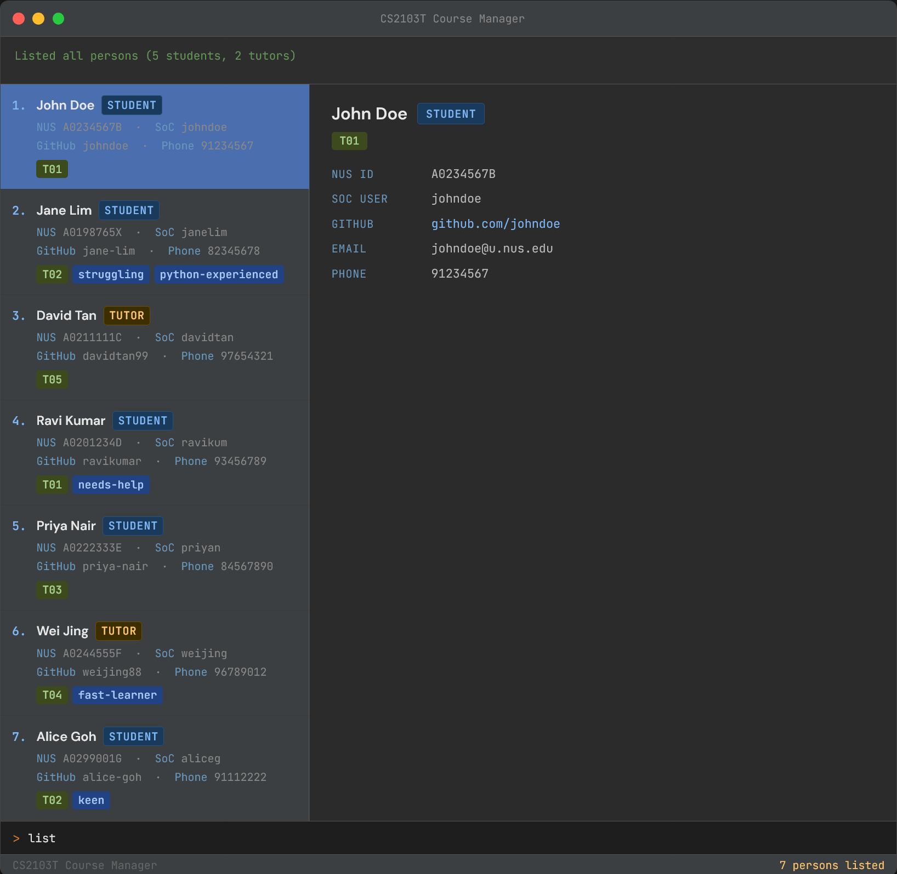

* This is **a Course Management System (CMS) for NUS CS Course Coordinators**.
  Example usages:
  * Managing large student cohorts of 500+ students and tutor teams
  * Tracking student and tutor contact details, tutorial groups, and progress
* The project is a desktop application used for managing course logistics via a fast, keyboard-driven CLI/GUI hybrid interface.
  * It is **written in OOP fashion**.
  * It comes with a **reasonable level of user and developer documentation**.
  *  It is designed specifically for a time-pressured, keyboard-first user who prefers batch operations and CLI efficiency.
* For the detailed documentation of this project, see the **[CS2103T Course Manager Product Website](https://ay2526s2-cs2103t-f10-2.github.io/tp/)**.
* Core features include:
  * **List** all students and tutors in the system
  * **Add** new students or tutors with fields such as NUS ID, SoC username, GitHub, email, phone, tutorial group, and tags
  * **Delete** existing student or tutor records by index
  * **Find** contacts by name (with plans to extend to other fields)
  * **Tag** students with custom labels (e.g., `struggling`, `needs-help`) for flexible annotation
* This project is based on the AddressBook-Level3 project created by the [SE-EDU initiative](https://se-education.org).
